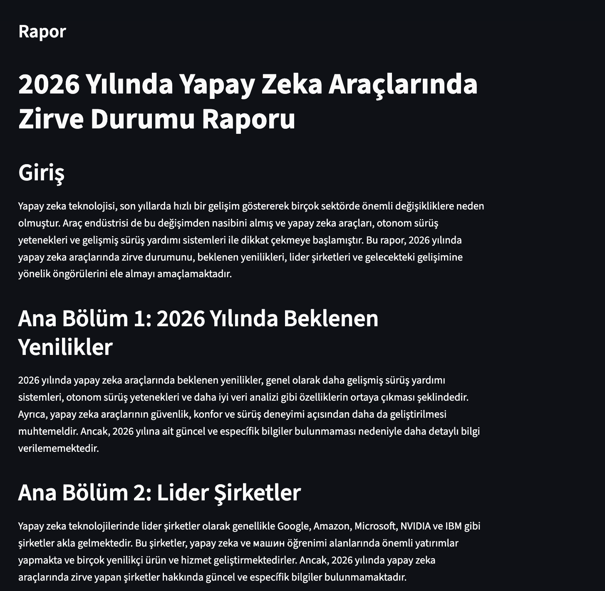

# DeepDesk

DeepDesk, verilen bir araştırma konusunu çok ajanlı bir akışla planlayan,
web'de araştıran, rapora dönüştüren ve önceki araştırmaları hafızasında
tutabilen; hem CLI hem de web arayüzü üzerinden kullanılabilen bir
araştırma asistanıdır.

Proje, Yapay Zeka ve Teknoloji Akademisi Bootcamp 2026 kapsamında
geliştirilmektedir. Sprint 1'de CLI tabanlı MVP, Sprint 2'de web arayüzü,
geri bildirim döngüsü ve çoklu dil desteği teslim edilmiştir.

## Proje Durumu

**Son doğrulama:** 16 Temmuz 2026 (Sprint 2)

Sprint 1 + Sprint 2 kapsamındaki özellikler çalışır durumdadır:

- Kullanıcı CLI veya Streamlit web arayüzü üzerinden bir araştırma
  konusu girer (Türkçe veya İngilizce).
- Planner Agent konuyu odaklı alt sorulara böler.
- Research Agent alt sorular için web araması yapar.
- Writer Agent bulguları profesyonel bir Markdown rapora dönüştürür;
  benzer konulardaki geçmiş kullanıcı geri bildirimlerini de dikkate
  alır.
- ChromaDB tabanlı hafıza katmanı geçmiş araştırmaları saklar.
- Kullanıcılar her rapor için 1-5 arası puan ve yorum bırakabilir; bu
  geri bildirimler kalıcı olarak saklanır ve gelecekteki raporları
  iyileştirmek için kullanılır.
- Rapor terminalde/tarayıcıda gösterilir ve `reports/` klasörüne
  kaydedilir.

Gerçek çalıştırma ve sprint board kanıtları:

- [Terminal çalıştırma ekran görüntüsü (Sprint 1)](docs/sprint1/screenshots/main_py_test_konusu_terminal.png)
- [Public GitHub Projects Sprint 1 board ekran görüntüsü](docs/sprint1/screenshots/github_projects_sprint1_board.png)
- [Public GitHub Projects board](https://github.com/users/ardamoustafa1/projects/1)
- [Sprint 2 ekran görüntüleri / doğrulama kanıtları](docs/sprint2/screenshots/) —
  gerçek Groq API anahtarıyla CLI (TR/EN) ve web arayüzünün uçtan uca
  çalıştırılmasının transkript ve ekran görüntülerini içerir.
- [Public GitHub Projects Sprint 2 board](https://github.com/users/ardamoustafa1/projects/2) —
  US-10, US-11, US-12'nin "Done" kolonunda olduğu board.




## Ürün Vizyonu

Araştırma yapmak isteyen kullanıcıların ilk bilgi toplama ve raporlama
sürecini hızlandırmak. DeepDesk, tek bir konu girdisinden yapılandırılmış,
okunabilir ve tekrar kullanılabilir bir araştırma raporu üretir.

Hedef kullanıcılar:

- Öğrenciler ve akademik ön araştırma yapanlar
- Girişimciler ve pazar araştırması yapan ekipler
- Analistler, içerik üreticileri ve ürün ekipleri
- Hızlı, düzenli ve tekrar kullanılabilir bilgi özeti isteyen kullanıcılar

## Mimari

DeepDesk üç ana ajan, bir hafıza katmanı ve bir geri bildirim katmanından
oluşur; CLI (`main.py`) ve web arayüzü (`web_app.py`) aynı orchestrator
akışını kullanır:

```text
Kullanıcı konusu + dil (tr/en)
    |
    v
Planner Agent  --------------------------+
    |                                    |
    v                                    |
Alt sorular                              |
    |                                    |
    v                                    |
Research Agent + web arama               |
    |                                    |
    v                                    |
Kaynaklı bulgular      Geçmiş geri bildirimler (FeedbackStore)
    |                                    |
    v                                    v
Writer Agent  <---------------------------
    |
    v
Markdown rapor + ChromaDB hafıza + kullanıcı geri bildirimi
```

Ana bileşenler:

- `Planner Agent`: Araştırma konusunu birbirini tamamlayan alt sorulara böler (TR/EN).
- `Research Agent`: DuckDuckGo HTML araması ile web sonuçlarını toplar ve Groq modeliyle özetler (TR/EN).
- `Writer Agent`: Alt soru bulgularını ve geçmiş geri bildirimleri tek bir Markdown raporuna dönüştürür (TR/EN).
- `ResearchMemory`: ChromaDB ile önceki raporları saklar ve benzer konularda geri çağırır.
- `FeedbackStore`: Kullanıcı puan/yorumlarını JSON olarak saklar, benzer konularda geri çağırır (US-11).
- `DeepDeskOrchestrator`: Planner, Research, Writer, Memory ve Feedback akışını yönetir.
- `web_app.py`: Streamlit tabanlı web arayüzü (US-10) — aynı orchestrator'ı kullanır.

## Teknoloji Yığını

- Python
- Groq API (`llama-3.3-70b-versatile` varsayılan model)
- DuckDuckGo HTML search
- ChromaDB
- Rich
- Streamlit (web arayüzü — Sprint 2)
- Pytest

## Kurulum

```bash
git clone https://github.com/ardamoustafa1/deepdesk.git
cd deepdesk

python3 -m venv venv
source venv/bin/activate

pip install -r requirements.txt
cp .env.example .env
```

`.env` dosyasına Groq API anahtarınızı ekleyin:

```env
GROQ_API_KEY=your_api_key_here
DEEPDESK_MODEL=llama-3.3-70b-versatile
DEEPDESK_MEMORY_DIR=.chroma_memory
DEEPDESK_MAX_SUBQUESTIONS=4
DEEPDESK_DEFAULT_LANGUAGE=tr
```

Windows kullanıyorsanız sanal ortam aktivasyonu:

```powershell
venv\Scripts\activate
```

## Kullanım

### CLI

```bash
# Türkçe (varsayılan)
python3 main.py "test konusu"

# İngilizce
python3 main.py "test topic" --lang en
```

Örnek akış:

```text
DeepDesk Araştırma Asistanı
Konu: test konusu

Alt Sorular:
  • Test konularının sınıflandırılması nasıl yapılır?
  • Test konularının öğrenme hedefleri nelerdir?
  • Test konularının öğrenci başarısına etkisi nedir?
  • Test konularının öğretim materyalleri ile ilişkisi nasıldır?

--- RAPOR ---
...

Rapor kaydedildi: reports/20260703_125446_report.md

Geri Bildirim
Bu raporu 1-5 arası puanlayın (atlamak için Enter): 5
Yorumunuz (opsiyonel): Çok faydalı bir özet oldu.
Geri bildiriminiz kaydedildi. Teşekkürler!
```

Rapor hem terminalde gösterilir hem de `reports/` klasörüne Markdown dosyası
olarak kaydedilir. Rapor sonunda bırakılan puan ve yorum, aynı veya benzer
bir konu tekrar araştırıldığında Writer Agent'a bağlam olarak verilir.

### Web Arayüzü (Sprint 2 — US-10)

```bash
streamlit run web_app.py
```

Tarayıcıda açılan arayüzden konu girilebilir, dil (TR/EN) seçilebilir,
alt sorular ve rapor görüntülenebilir, rapor `.md` olarak indirilebilir
ve rapor için puan/yorum bırakılabilir.

## Testler

```bash
pytest tests/ -v
```

Not: ChromaDB ilk çalıştırmada embedding modeli indirebilir. Bu nedenle ilk
çalıştırma internet bağlantısı gerektirebilir ve sonraki çalıştırmalara göre
daha uzun sürebilir.

## Proje Yapısı

```text
deepdesk/
├── main.py
├── web_app.py
├── src/
│   ├── orchestrator.py
│   ├── agents/
│   │   ├── planner_agent.py
│   │   ├── research_agent.py
│   │   └── writer_agent.py
│   ├── memory/
│   │   ├── vector_store.py
│   │   └── feedback_store.py
│   └── utils/
│       └── config.py
├── tests/
├── docs/
│   ├── sprint1/
│   │   ├── backlog.md
│   │   ├── daily_scrum_notes.md
│   │   ├── product_status.md
│   │   ├── sprint_board.md
│   │   ├── sprint_retrospective.md
│   │   ├── sprint_review.md
│   │   └── screenshots/
│   └── sprint2/
│       ├── backlog.md
│       ├── daily_scrum_notes.md
│       ├── product_status.md
│       ├── sprint_board.md
│       ├── sprint_retrospective.md
│       ├── sprint_review.md
│       └── screenshots/
├── reports/
├── requirements.txt
└── README.md
```

## Sprint 1 Teslim Kapsamı

Sprint 1 hedefi, uçtan uca çalışan bir MVP üretmekti. Aşağıdaki user story'ler
tamamlandı ve GitHub Projects board üzerinde `Done` kolonuna taşındı:

| ID | User Story | Durum |
|---|---|---|
| US-01 | Proje iskeleti ve config yönetimi kurulumu | Done |
| US-02 | Planner Agent: konuyu alt sorulara bölme | Done |
| US-03 | Research Agent: web arama entegrasyonu | Done |
| US-04 | Writer Agent: bulguları rapora dönüştürme | Done |
| US-05 | Hafıza katmanı: ChromaDB entegrasyonu | Done |
| US-06 | Orchestrator: agent'ları birbirine bağlama | Done |
| US-07 | CLI arayüzü (Rich ile) | Done |
| US-08 | Birim testleri (planner + hafıza) | Done |
| US-09 | README ve dokümantasyon | Done |

Sprint dokümantasyonu:

- [Sprint backlog](docs/sprint1/backlog.md)
- [Sprint board notları](docs/sprint1/sprint_board.md)
- [Sprint review](docs/sprint1/sprint_review.md)
- [Sprint retrospective](docs/sprint1/sprint_retrospective.md)
- [Ürün durumu](docs/sprint1/product_status.md)

## Sprint 2 Teslim Kapsamı

Sprint 2 hedefi, Sprint 1'de bekleyen üç user story'yi tamamlamaktı.
Aşağıdaki user story'ler tamamlandı ve GitHub Projects board üzerinde
`Done` kolonuna taşındı:

| ID | User Story | Durum |
|---|---|---|
| US-10 | Streamlit tabanlı basit web arayüzü | Done |
| US-11 | Rapor kalitesi için kullanıcı geri bildirim döngüsü | Done |
| US-12 | Çoklu dil desteği (EN/TR) | Done |

Sprint dokümantasyonu:

- [Sprint backlog](docs/sprint2/backlog.md)
- [Sprint board notları](docs/sprint2/sprint_board.md)
- [Sprint review](docs/sprint2/sprint_review.md)
- [Sprint retrospective](docs/sprint2/sprint_retrospective.md)
- [Ürün durumu](docs/sprint2/product_status.md)

## Bilinen Sınırlamalar

- Tek çalıştırmada tek araştırma konusu işlenir (batch mod yok).
- Web araması ücretsiz DuckDuckGo HTML endpoint'i üzerinden yapıldığı için sonuç kalitesi ve erişilebilirlik dış servise bağlıdır.
- Rapor uzunluğu model token limitiyle sınırlıdır.
- Rapor yalnızca Markdown formatında üretilir; PDF export Sprint 3 kapsamına alınmıştır.
- Geri bildirim eşleştirmesi basit kelime kesişimine dayanır; anlamsal (embedding tabanlı) benzerlik kullanmaz.
- Üretilen raporlar kullanıcı tarafından doğrulanmalıdır; DeepDesk karar destek aracı olarak tasarlanmıştır.

## Yol Haritası

- Sprint 3: PDF export
- Sprint 3: Daha gelişmiş kaynak doğrulama ve rapor skorlama

## Geliştirme Notu

Bu proje sıfırdan geliştirilmiştir. Geliştirme sürecinde AI destekli kodlama
araçlarından yararlanılmıştır; mimari kararlar, testler, dokümantasyon ve proje
yönetimi çıktıları Sprint 1 ve Sprint 2 teslim kriterlerine uygun şekilde
hazırlanmıştır.
