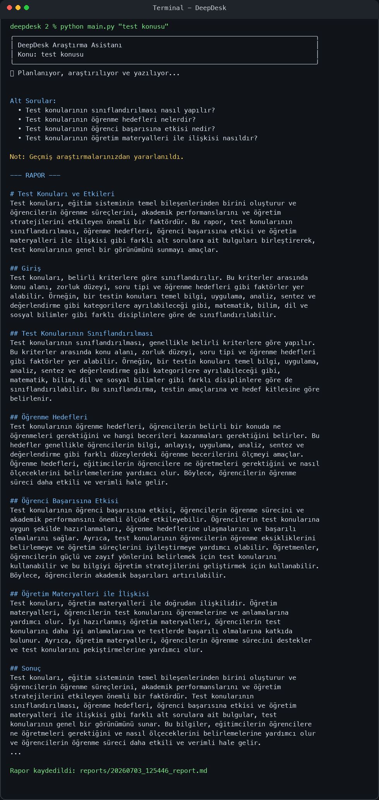
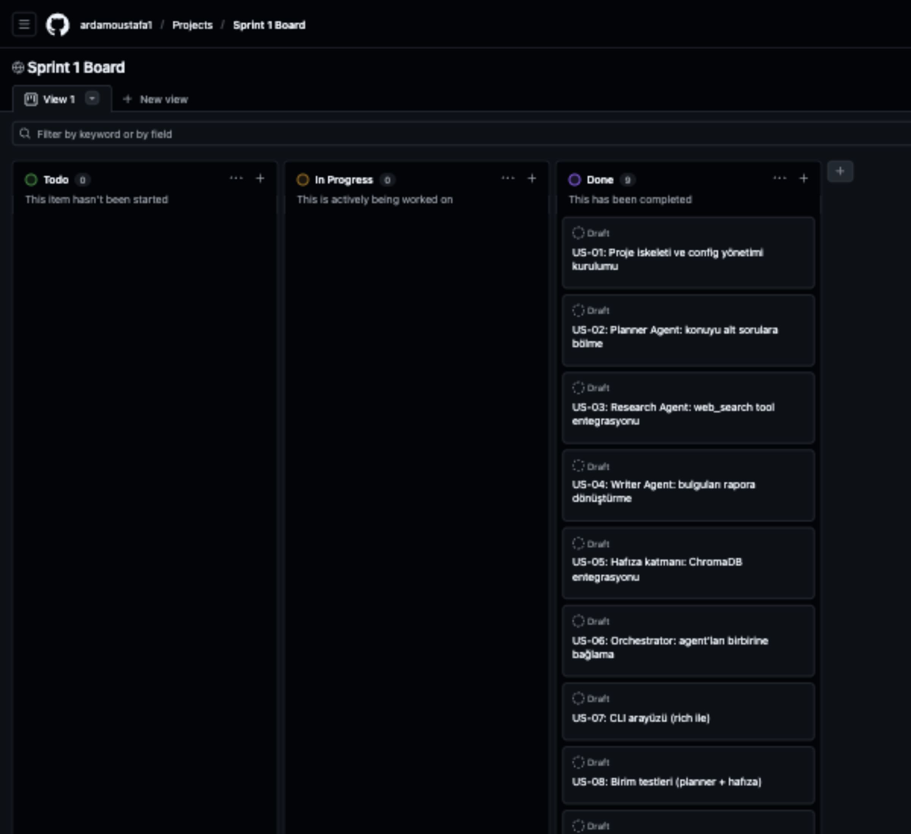

# DeepDesk

DeepDesk, verilen bir araştırma konusunu çok ajanlı bir akışla planlayan,
web'de araştıran, rapora dönüştüren ve önceki araştırmaları hafızasında
tutabilen CLI tabanlı bir araştırma asistanıdır.

Proje, Yapay Zeka ve Teknoloji Akademisi Bootcamp 2026 kapsamında Sprint 1
MVP teslimi olarak geliştirilmiştir.

## Proje Durumu

**Son doğrulama:** 3 Temmuz 2026

Sprint 1 kapsamındaki çekirdek MVP çalışır durumdadır:

- Kullanıcı CLI üzerinden bir araştırma konusu girer.
- Planner Agent konuyu odaklı alt sorulara böler.
- Research Agent alt sorular için web araması yapar.
- Writer Agent bulguları profesyonel bir Markdown rapora dönüştürür.
- ChromaDB tabanlı hafıza katmanı geçmiş araştırmaları saklar.
- Rapor terminalde gösterilir ve `reports/` klasörüne kaydedilir.

Gerçek çalıştırma ve sprint board kanıtları:

- [Terminal çalıştırma ekran görüntüsü](docs/sprint1/screenshots/main_py_test_konusu_terminal.png)
- [Public GitHub Projects Sprint 1 board ekran görüntüsü](docs/sprint1/screenshots/github_projects_sprint1_board.png)
- [Public GitHub Projects board](https://github.com/users/ardamoustafa1/projects/1)





## Ürün Vizyonu

Araştırma yapmak isteyen kullanıcıların ilk bilgi toplama ve raporlama
sürecini hızlandırmak. DeepDesk, tek bir konu girdisinden yapılandırılmış,
okunabilir ve tekrar kullanılabilir bir araştırma raporu üretir.

Hedef kullanıcılar:

- Öğrenciler ve akademik ön araştırma yapanlar
- Girişimciler ve pazar araştırması yapan ekipler
- Analistler, içerik üreticileri ve ürün ekipleri
- Hızlı, düzenli ve tekrar kullanılabilir bilgi özeti isteyen kullanıcılar

## Mimari

DeepDesk üç ana ajan ve bir hafıza katmanından oluşur:

```text
Kullanıcı konusu
    |
    v
Planner Agent
    |
    v
Alt sorular
    |
    v
Research Agent + web arama
    |
    v
Kaynaklı bulgular
    |
    v
Writer Agent
    |
    v
Markdown rapor + ChromaDB hafıza
```

Ana bileşenler:

- `Planner Agent`: Araştırma konusunu birbirini tamamlayan alt sorulara böler.
- `Research Agent`: DuckDuckGo HTML araması ile web sonuçlarını toplar ve Groq modeliyle özetler.
- `Writer Agent`: Alt soru bulgularını tek bir Markdown raporuna dönüştürür.
- `ResearchMemory`: ChromaDB ile önceki raporları saklar ve benzer konularda geri çağırır.
- `DeepDeskOrchestrator`: Planner, Research, Writer ve Memory akışını yönetir.

## Teknoloji Yığını

- Python
- Groq API (`llama-3.3-70b-versatile` varsayılan model)
- DuckDuckGo HTML search
- ChromaDB
- Rich
- Pytest

## Kurulum

```bash
git clone https://github.com/ardamoustafa1/deepdesk.git
cd deepdesk

python3 -m venv venv
source venv/bin/activate

pip install -r requirements.txt
cp .env.example .env
```

`.env` dosyasına Groq API anahtarınızı ekleyin:

```env
GROQ_API_KEY=your_api_key_here
DEEPDESK_MODEL=llama-3.3-70b-versatile
DEEPDESK_MEMORY_DIR=.chroma_memory
DEEPDESK_MAX_SUBQUESTIONS=4
```

Windows kullanıyorsanız sanal ortam aktivasyonu:

```powershell
venv\Scripts\activate
```

## Kullanım

```bash
python3 main.py "test konusu"
```

Örnek akış:

```text
DeepDesk Araştırma Asistanı
Konu: test konusu

Alt Sorular:
  • Test konularının sınıflandırılması nasıl yapılır?
  • Test konularının öğrenme hedefleri nelerdir?
  • Test konularının öğrenci başarısına etkisi nedir?
  • Test konularının öğretim materyalleri ile ilişkisi nasıldır?

--- RAPOR ---
...

Rapor kaydedildi: reports/20260703_125446_report.md
```

Rapor hem terminalde gösterilir hem de `reports/` klasörüne Markdown dosyası
olarak kaydedilir.

## Testler

```bash
pytest tests/ -v
```

Not: ChromaDB ilk çalıştırmada embedding modeli indirebilir. Bu nedenle ilk
çalıştırma internet bağlantısı gerektirebilir ve sonraki çalıştırmalara göre
daha uzun sürebilir.

## Proje Yapısı

```text
deepdesk/
├── main.py
├── src/
│   ├── orchestrator.py
│   ├── agents/
│   │   ├── planner_agent.py
│   │   ├── research_agent.py
│   │   └── writer_agent.py
│   ├── memory/
│   │   └── vector_store.py
│   └── utils/
│       └── config.py
├── tests/
├── docs/
│   └── sprint1/
│       ├── backlog.md
│       ├── daily_scrum_notes.md
│       ├── product_status.md
│       ├── sprint_board.md
│       ├── sprint_retrospective.md
│       ├── sprint_review.md
│       └── screenshots/
├── reports/
├── requirements.txt
└── README.md
```

## Sprint 1 Teslim Kapsamı

Sprint 1 hedefi, uçtan uca çalışan bir MVP üretmekti. Aşağıdaki user story'ler
tamamlandı ve GitHub Projects board üzerinde `Done` kolonuna taşındı:

| ID | User Story | Durum |
|---|---|---|
| US-01 | Proje iskeleti ve config yönetimi kurulumu | Done |
| US-02 | Planner Agent: konuyu alt sorulara bölme | Done |
| US-03 | Research Agent: web arama entegrasyonu | Done |
| US-04 | Writer Agent: bulguları rapora dönüştürme | Done |
| US-05 | Hafıza katmanı: ChromaDB entegrasyonu | Done |
| US-06 | Orchestrator: agent'ları birbirine bağlama | Done |
| US-07 | CLI arayüzü (Rich ile) | Done |
| US-08 | Birim testleri (planner + hafıza) | Done |
| US-09 | README ve dokümantasyon | Done |

Sprint dokümantasyonu:

- [Sprint backlog](docs/sprint1/backlog.md)
- [Sprint board notları](docs/sprint1/sprint_board.md)
- [Sprint review](docs/sprint1/sprint_review.md)
- [Sprint retrospective](docs/sprint1/sprint_retrospective.md)
- [Ürün durumu](docs/sprint1/product_status.md)

## Bilinen Sınırlamalar

- Uygulama şu an CLI üzerinden çalışır; web arayüzü Sprint 2 kapsamına alınmıştır.
- Tek çalıştırmada tek araştırma konusu işlenir.
- Web araması ücretsiz DuckDuckGo HTML endpoint'i üzerinden yapıldığı için sonuç kalitesi ve erişilebilirlik dış servise bağlıdır.
- Rapor uzunluğu model token limitiyle sınırlıdır.
- Üretilen raporlar kullanıcı tarafından doğrulanmalıdır; DeepDesk karar destek aracı olarak tasarlanmıştır.

## Yol Haritası

- Sprint 2: Streamlit veya FastAPI tabanlı basit web arayüzü
- Sprint 2: Kullanıcı geri bildirimiyle rapor kalitesi iyileştirme
- Sprint 2: Çoklu dil desteği
- Sprint 3: PDF export
- Sprint 3: Daha gelişmiş kaynak doğrulama ve rapor skorlama

## Geliştirme Notu

Bu proje sıfırdan geliştirilmiştir. Geliştirme sürecinde AI destekli kodlama
araçlarından yararlanılmıştır; mimari kararlar, testler, dokümantasyon ve proje
yönetimi çıktıları Sprint 1 teslim kriterlerine uygun şekilde hazırlanmıştır.
