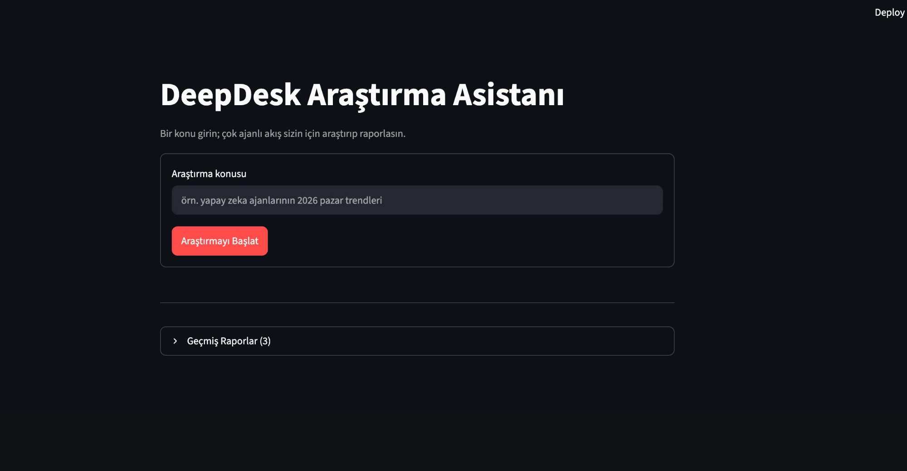
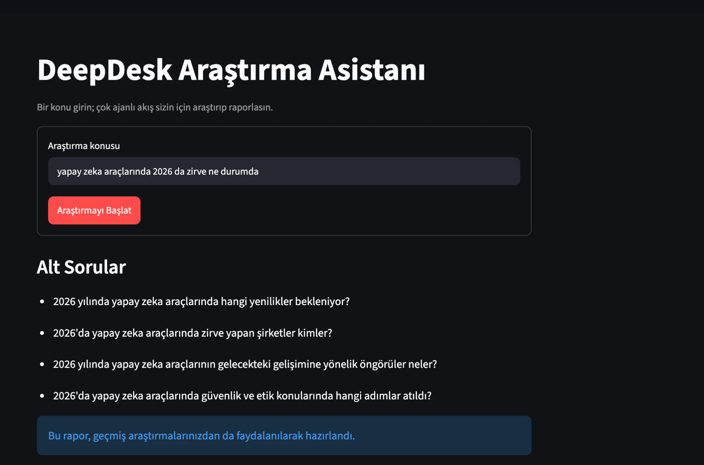
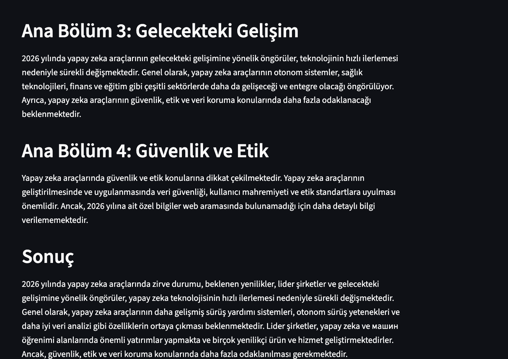
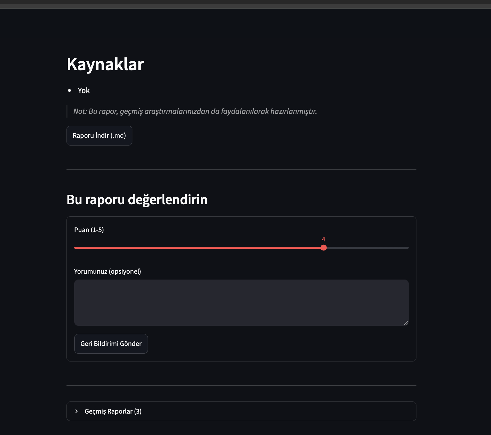

# Sprint 2 — Ürün Durumu

## Genel Durum
Sprint 2 sonunda DeepDesk, Sprint 1'in CLI-only MVP'sinin üzerine üç yeni
yetenek kazandı:

✅ Streamlit tabanlı web arayüzü üzerinden araştırma yapılabiliyor (US-10)
✅ Kullanıcılar raporları 1-5 arası puanlayıp yorum bırakabiliyor (US-11)
✅ Geçmiş geri bildirimler, benzer konularda yeni rapor üretilirken
  Writer Agent'a bağlam olarak veriliyor (US-11)
✅ CLI ve web arayüzü hem Türkçe hem İngilizce çalışabiliyor (US-12)
✅ CLI, Sprint 1'deki tüm davranışını (rapor kaydetme, hafıza notu vb.)
  korudu; hiçbir geriye dönük uyumluluk kırılmadı

## Doğrulama Kanıtları

### 1) Otomatik testler
Bu sprintte eklenen `FeedbackStore`, `WriterAgent` dil/geri bildirim
mantığı ve `PlannerAgent` dil desteği için yeni birim testleri yazıldı.
Sprint 1'deki tüm testler de değişmeden geçmeye devam ediyor:

```bash
$ pytest tests/ -v
...
tests/test_feedback_store.py::test_empty_store_has_no_related_feedback PASSED
tests/test_feedback_store.py::test_empty_store_has_no_average_rating PASSED
tests/test_feedback_store.py::test_add_and_retrieve_related_feedback PASSED
tests/test_feedback_store.py::test_unrelated_topic_returns_no_feedback PASSED
tests/test_feedback_store.py::test_add_rejects_out_of_range_rating PASSED
tests/test_feedback_store.py::test_average_rating PASSED
tests/test_feedback_store.py::test_all_returns_every_feedback_entry PASSED
tests/test_memory.py::test_empty_memory_returns_no_related PASSED
tests/test_memory.py::test_save_and_retrieve PASSED
tests/test_memory.py::test_multiple_saves_increase_count PASSED
tests/test_planner_agent.py::test_plan_parses_valid_json PASSED
tests/test_planner_agent.py::test_plan_respects_max_questions_limit PASSED
tests/test_planner_agent.py::test_plan_strips_markdown_code_fence PASSED
tests/test_planner_agent.py::test_plan_defaults_to_turkish_prompt PASSED
tests/test_planner_agent.py::test_plan_uses_english_prompt_for_en_language PASSED
tests/test_writer_agent.py::test_write_report_uses_turkish_prompt_by_default PASSED
tests/test_writer_agent.py::test_write_report_uses_english_prompt_when_requested PASSED
tests/test_writer_agent.py::test_write_report_includes_past_feedback_comments PASSED
tests/test_writer_agent.py::test_write_report_ignores_feedback_without_comment PASSED

======================== 19 passed in 4.39s ========================
```

### 2) Gerçek Groq API anahtarıyla uçtan uca doğrulama (16 Temmuz 2026)
Gerçek bir Groq API anahtarı `.env` dosyasına eklenip hem CLI hem web
arayüzü canlı olarak çalıştırıldı; tüm akış (Planner → Research →
Writer → Memory → Feedback) baştan sona doğrulandı:

- **CLI (Türkçe):** `python3 main.py "yapay zeka ajanlarinin 2026 pazar
  trendleri"` — alt sorular üretildi, kaynaklı rapor yazıldı, hafıza
  notu eklendi, rapor `reports/` klasörüne kaydedildi, rapor sonunda
  1-5 puan + yorum girildi ve `reports/feedback.json`'a kaydedildi.
  Tam transkript: [cli_run_transcript.txt](screenshots/cli_run_transcript.txt)
- **CLI (İngilizce):** `python3 main.py "renewable energy storage
  technologies 2026" --lang en` — tüm çıktı (alt sorular, rapor,
  kaynaklar, geri bildirim istemi) doğru şekilde İngilizce üretildi.
  Tam transkript: [cli_run_transcript_en.txt](screenshots/cli_run_transcript_en.txt)
- **Web arayüzü (Türkçe):** `streamlit run web_app.py` ile açılan
  arayüzden "sürdürülebilir enerji depolama teknolojileri 2026" konusu
  araştırıldı; alt sorular, hafıza notu, tam rapor, "Raporu İndir (.md)"
  butonu ve geri bildirim formu ("Puan (1-5)" + yorum) uçtan uca
  çalıştı; gönderilen geri bildirim `reports/feedback.json`'a başarıyla
  eklendi ve arayüzde "Geri bildiriminiz için teşekkürler!" mesajı
  gösterildi.
- **Web arayüzü — boş/hata durumları:** Konu girilmeden gönderildiğinde
  "Lütfen bir araştırma konusu girin." uyarısı; `.env`/`GROQ_API_KEY`
  yokken çalıştırıldığında kullanıcıyı `.env.example`'a yönlendiren
  açıklayıcı bir hata mesajı gösterildi (uygulama çökmedi).
- **Dil geçişi:** Kenar çubuğundaki dil seçiciden "English" seçildiğinde
  tüm arayüz metinleri (başlık, etiketler, butonlar, geçmiş raporlar
  paneli) anında İngilizce'ye döndü.

Bu doğrulama sırasında üretilen gerçek rapor dosyaları:
`reports/20260716_145856_report.md`, `reports/20260716_150033_report.md`,
`reports/20260716_150644_report.md` (bunlar `.gitignore` ile
repoya dahil edilmez, yalnızca yerel doğrulama kanıtıdır).

### Web arayüzü ekran görüntüleri (gerçek çalıştırma)










### 3) CLI kullanım örneği

```bash
# Türkçe (varsayılan)
$ python3 main.py "elektrikli araç pazarı 2026 trendleri"

# İngilizce
$ python3 main.py "2026 market trends for electric vehicles" --lang en

# Web arayüzü
$ streamlit run web_app.py
```

## Bilinen Sınırlamalar (Sprint 3'te ele alınacak)
- Rapor çıktısı yalnızca Markdown formatında; PDF export yok (US-13).
- Kaynak doğrulama ve rapor skorlama mekanizması yok (US-14).
- Geri bildirim eşleştirmesi basit kelime kesişimine dayanıyor; anlamsal
  (embedding tabanlı) benzerlik kullanmıyor.
